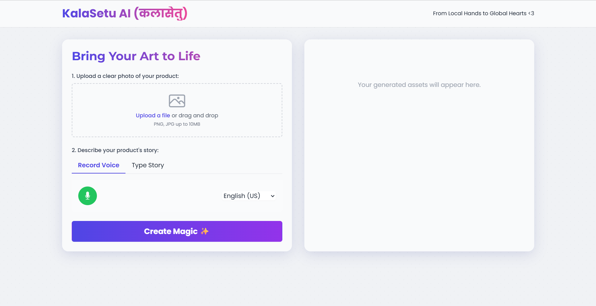

# KalaSetu AI ✨ (कलासेतु)

KalaSetu AI is a full-stack web application designed to empower local artisans by generating professional marketing assets using generative AI. Artisans can upload a photo of their product and share its story, and the app will create a product title, a compelling narrative, social media captions, and AI-generated lifestyle photos.


*(Suggestion: Add a screenshot of your app here)*

---

## ## Features

* **Secure Full-Stack Architecture:** Client-server model with a Python (FastAPI) back-end to protect API keys.
* **AI-Powered Text Generation:** Uses Google's Gemini Pro to create titles, stories, and social media captions.
* **AI Image Generation:** Uses Stability AI (Stable Diffusion) to create realistic lifestyle product photos from text prompts.
* **Clean, Responsive UI:** A simple and intuitive front-end built with HTML and Tailwind CSS.

---

## ## Tech Stack

* **Front-End:** HTML, Tailwind CSS, Vanilla JavaScript
* **Back-End:** Python, FastAPI
* **APIs:**
    * Google Gemini API (for text)
    * Stability AI API (for images)

---

## ## Setup and Installation

To run this project locally, follow these steps:

1.  **Clone the repository:**
    ```bash
    git clone [https://github.com/your-username/KalaSetu-AI-Generator.git](https://github.com/your-username/KalaSetu-AI-Generator.git)
    cd KalaSetu-AI-Generator
    ```
2.  **Set up the back-end:**
    ```bash
    cd backend
    pip install -r requirements.txt # (You may need to create a requirements.txt file)
    ```
3.  **Create your `.env` file** in the `backend` folder and add your API keys:
    ```
    GOOGLE_API_KEY="your_google_api_key_here"
    STABILITY_API_KEY="your_stability_api_key_here"
    ```
4.  **Run the back-end server:**
    ```bash
    uvicorn main:app --reload
    ```
5.  **Run the front-end:**
    * Navigate to the `frontend` folder.
    * Open the `index.html` file in your browser.

---